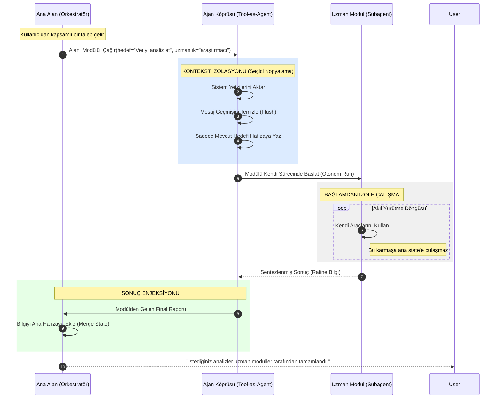

# 📊 Ajan Orkestrasyonu: Tool-as-Agent Mimarisi

Bu diyagram, ana ajanın (Orchestrator) alt ajanları birer **"Ajan Modülü"** (Tool-as-Agent) olarak nasıl yönettiğini ve her birinin neden izole bir odada çalıştığını gösterir.

### 🧠 Neler Değişti? (Tool-as-Agent Mantığı)
1.  **Fonksiyon İsimleri:** `task(...)` yerine `Ajan_Modülü_Çağır(...)` ifadesini kullandık.
2.  **Parametre İsimleri:** `description` yerine `hedef`, `type` yerine `uzmanlık` terimlerini kullanarak aracın ne işe yaradığını netleştirdik.
3.  **İzolasyon Vurgusu:** Ana ajanın geçmişini sildiği ("Flush") ve alt ajanın kendi başına "Akıl Yürütme Döngüsü"ne girdiği kısımları teknik terimlerden arındırıp daha anlaşılır kıldık.
