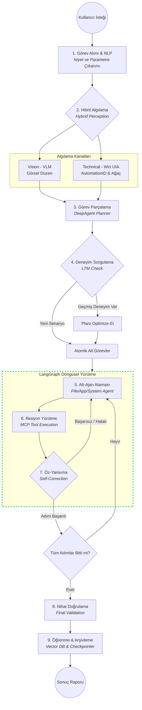

# VILAGENT Sistem Akış Diyagramı

VILAGENT projesinin temel çalışma prensibini ve bileşenler arasındaki etkileşimi gösteren akış diyagramı aşağıdadır.

## Süreç Özeti

1.  **Giriş:** Kullanıcı doğal dil ile komut verir.
2.  **Algılama:** Ekran hem görsel (VLM) hem teknik (UIA) olarak taranır.
3.  **Planlama (DeepAgent):** Karmaşık görev, bellekten gelen eski verilerle harmanlanarak küçük parçalara bölünür.
4.  **Döngüsel Yürütme (LangGraph):** Uzman ajanlar (Dosya, Uygulama vb.) MCP üzerinden araçları kullanır. Her adımda hata kontrolü (Self-Reflection) yapılarak gerekirse süreç başa döner.
5.  **Bitiş:** Görev doğrulandıktan sonra başarı hikayesi olarak kaydedilir ve kullanıcıya rapor sunulur.
